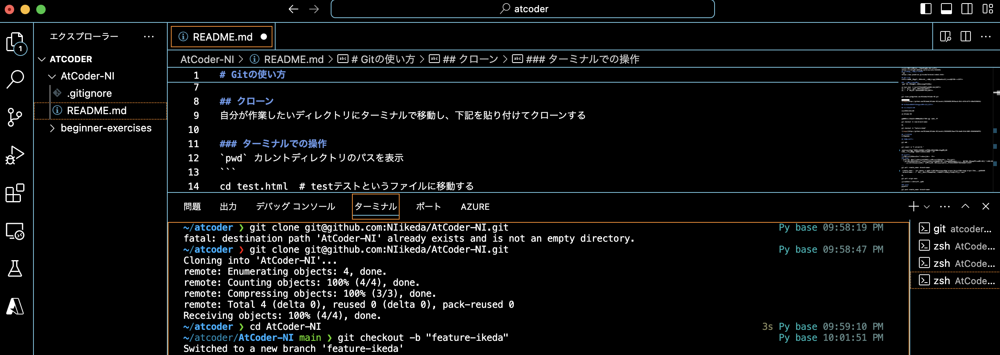

# Gitの使い方
用語がわからなくなったらbacklogにまとまってる
<https://n-insight.backlog.com/alias/wiki/3426385>
## vscodeでターミナルを開く
参考
<https://www.javadrive.jp/vscode/terminal/index1.html>

## クローン
自分が作業したいディレクトリにターミナルで移動し、下記を貼り付けてクローンする

### ターミナルでの操作
`pwd` カレントディレクトリのパスを表示
```
cd test.html  # testテストというファイルに移動する
cd ~/  #ホームディレクトリに移動する
cd ..  #一つ上の階層のファイルに移動する
```

```
git clone git@github.com:NIikeda/AtCoder-NI.git
```
こんな感じ

## GitHubのアカウントでsshキーを登録する
https://zenn.dev/taki_san/articles/e18613a464e74b


## ブランチを作成

リポジトリに移動
```
cd AtCoder-NI
```

新しいブランチを作成し、切り替えまで一気に行う
```
git checkout -b <new-branch-name>
```
例
```
git checkout -b "feature-ikeda"
```


## 問題を解く
がんば！！

## コミットする
```
git add .
```
```
git commit -m "I solved Q1."
```
-mの後はなんでもいいが何かしら記述しないとコミットできない  
解いた問題番号でも書いておくのがいいだろう

## pushする
ローカルリポジトリをリモートリポに反映する
### step1
- push前に一度リモートリポの内容をローカルリポジトリに反映する(pull)
  - pullしないと誰かがリモートリポジトリを更新していた場合、古い情報のまま反映してしまい、バグが起きる可能性があるから
    - 今回の場合は、その可能性は限りなく低いが、今後gitを使うことを考えて癖をつけておこう
   
```
git pull <remote_name> <branch-name>
```
`<remote_name>`: `git remote -v`で確認が可能。通常は自動で`origin`となっているので`origin`を入れれば大丈夫  
`<branch-name>`: 反映させたいブランチ名を入れる。要するに、今回のケースなら`main`

例
```
git pull origin main
```
今回はこのままコピペすればOK

### step2
pushする
```
git push <remote_name> <branch-name>
```
`<remote_name>`: `git remote -v`で確認が可能。通常は自動で`origin`となっているので`origin`を入れれば大丈夫 
`<branch-name>`: 反映するブランチ名を入れる。要するに、自分が作成したbranch名。今回のケースなら`feature-ikeda`  
例
```
git push origin feature-ikeda
```


